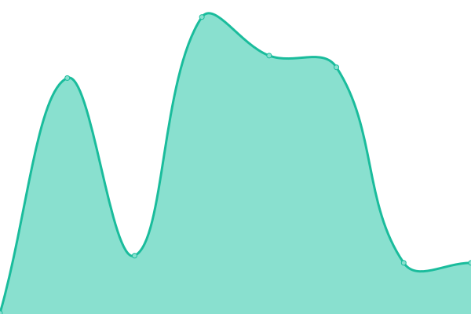
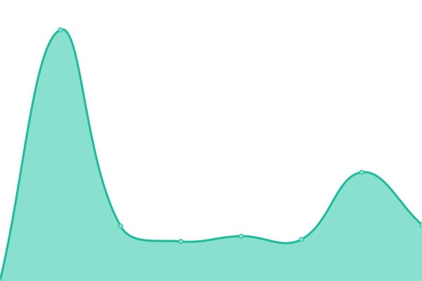

# [📈 Live Status](https://uptime.gbe0.com): <!--live status--> **🟩 All systems operational**

This repository contains the open-source uptime monitor and status page for [Chris](https://gbe0.com), powered by [Upptime](https://github.com/upptime/upptime).

With [Upptime](https://upptime.js.org), you can get your own unlimited and free uptime monitor and status page, powered entirely by a GitHub repository. We use [Issues](https://github.com/gbe0/uptime/issues) as incident reports, [Actions](https://github.com/gbe0/uptime/actions) as uptime monitors, and [Pages](https://uptime.gbe0.com) for the status page.

<!--start: status pages-->
<!-- This summary is generated by Upptime (https://github.com/upptime/upptime) -->
<!-- Do not edit this manually, your changes will be overwritten -->
<!-- prettier-ignore -->
| URL | Status | History | Response Time | Uptime |
| --- | ------ | ------- | ------------- | ------ |
|  GitLab | 🟩 Up | [git-lab.yml](https://github.com/gbe0/uptime/commits/HEAD/history/git-lab.yml) | 

 1334ms
     
 | 

<a href="https://uptime.gbe0.com/history/git-lab">99.19%</a>
    

|  cPanel Server 1 | 🟩 Up | [c-panel-server-1.yml](https://github.com/gbe0/uptime/commits/HEAD/history/c-panel-server-1.yml) | 

 731ms
     
 | 

<a href="https://uptime.gbe0.com/history/c-panel-server-1">100.00%</a>
    

|  cPanel Server 2 | 🟩 Up | [c-panel-server-2.yml](https://github.com/gbe0/uptime/commits/HEAD/history/c-panel-server-2.yml) | 

 727ms
     
 | 

<a href="https://uptime.gbe0.com/history/c-panel-server-2">100.00%</a>
    

|  Docker Server 1 | 🟩 Up | [docker-server-1.yml](https://github.com/gbe0/uptime/commits/HEAD/history/docker-server-1.yml) | 

 127ms
     
 | 

<a href="https://uptime.gbe0.com/history/docker-server-1">99.68%</a>
    

|  VPN - Singapore, SG | 🟩 Up | [vpn-singapore-sg.yml](https://github.com/gbe0/uptime/commits/HEAD/history/vpn-singapore-sg.yml) | 

 862ms
     
 | 

<a href="https://uptime.gbe0.com/history/vpn-singapore-sg">100.00%</a>
    

|  VPN - Fremont, USA | 🟩 Up | [vpn-fremont-usa.yml](https://github.com/gbe0/uptime/commits/HEAD/history/vpn-fremont-usa.yml) | 

 152ms
     
 | 

<a href="https://uptime.gbe0.com/history/vpn-fremont-usa">100.00%</a>
    

|  VPN - Manila, PH | 🟩 Up | [vpn-manila-ph.yml](https://github.com/gbe0/uptime/commits/HEAD/history/vpn-manila-ph.yml) | 

 840ms
     
 | 

<a href="https://uptime.gbe0.com/history/vpn-manila-ph">100.00%</a>
    

|  VPN - Frankfurt, DE | 🟩 Up | [vpn-frankfurt-de.yml](https://github.com/gbe0/uptime/commits/HEAD/history/vpn-frankfurt-de.yml) | 

 612ms
     
 | 

<a href="https://uptime.gbe0.com/history/vpn-frankfurt-de">100.00%</a>
    

|  VPN - Sydney, AU | 🟩 Up | [vpn-sydney-au.yml](https://github.com/gbe0/uptime/commits/HEAD/history/vpn-sydney-au.yml) | 

 691ms
     
 | 

<a href="https://uptime.gbe0.com/history/vpn-sydney-au">100.00%</a>
    

|  Bookmarks | 🟩 Up | [bookmarks.yml](https://github.com/gbe0/uptime/commits/HEAD/history/bookmarks.yml) | 

 351ms
     
 | 

<a href="https://uptime.gbe0.com/history/bookmarks">99.68%</a>
    

|  Key Management Service IPv4 | 🟩 Up | [key-management-service-i-pv4.yml](https://github.com/gbe0/uptime/commits/HEAD/history/key-management-service-i-pv4.yml) | 

 25ms
     
 | 

<a href="https://uptime.gbe0.com/history/key-management-service-i-pv4">99.68%</a>
    

|  [gbe0.com](https://gbe0.com) | 🟩 Up | [gbe0-com.yml](https://github.com/gbe0/uptime/commits/HEAD/history/gbe0-com.yml) | 

 152ms
     
 | 

<a href="https://uptime.gbe0.com/history/gbe0-com">99.68%</a>
    

|  [wiki.gbe0.com](https://wiki.gbe0.com) | 🟩 Up | [wiki-gbe0-com.yml](https://github.com/gbe0/uptime/commits/HEAD/history/wiki-gbe0-com.yml) | 

 166ms
     
 | 

<a href="https://uptime.gbe0.com/history/wiki-gbe0-com">99.68%</a>
    

<!--end: status pages-->

[**Visit our status website →**](https://uptime.gbe0.com)

## 📄 License

- Powered by: [Upptime](https://github.com/upptime/upptime)
- Code: [MIT](./LICENSE) © [Chris](https://gbe0.com)
- Data in the `./history` directory: [Open Database License](https://opendatacommons.org/licenses/odbl/1-0/)
